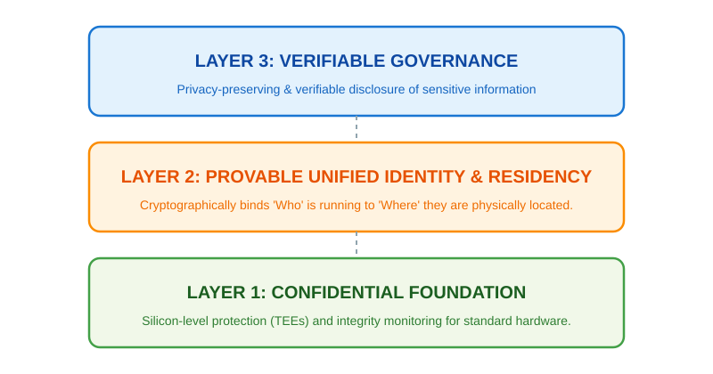
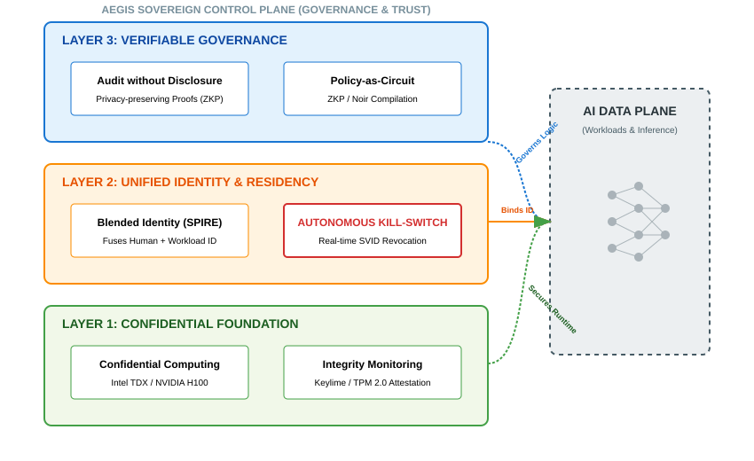

# AegisSovereignAI: Trusted AI for the Distributed Enterprise

## Executive Summary
In a Distributed Enterprise, Infrastructure Security (Layer 1 in Figure 1) and AI Governance (Layer 3 in Figure 1) are often loosely coupled across the spectrum from **centralized clouds to the far edge**. This fragmentation results in a dangerous **"Accountability Gap"** where workload/user identities are easily spoofed, compliance creates massive **Personally Identifiable Information (PII)** liability, and compromised infrastructure — whether in a hyperscale data center or a remote branch office — can feed fake data to applications undetected. 

**AegisSovereignAI** bridges this gap by serving as a unifying control plane for the comprehensive distributed footprint. Through a **Unified and Extensible Identity (Layer 2 in Figure 1)** framework, it cryptographically fuses workloads/user identities using silicon-level attestation with application-level governance while preserving privacy to create a single, cohesive identity architecture that extends from the **Cloud Core to the Far Edge**.

This transforms AI security from "Best-Effort" Zero-trust to **Privacy-First Verifiable Intelligence**. **This ensures that sensitive data (financial, medical, etc.) is processed only when the hardware, the location, and the workload/user identity are simultaneously verified, providing end-to-end sovereignty across the entire enterprise estate.**

*Figure 1: AegisSovereignAI Architecture Summary - Bridging Infrastructure, Identity, and Governance.*

**[Hybrid Cloud PoC for Unified Identity](./hybrid-cloud-poc/README.md)** - **Try it out with concrete use cases.**

## Enterprise Sovereign Use Cases (Focus: Financial Services)

### 1. The Enterprise Customer (Retail/Private Banking End-Consumer)
*   **Core Use Case:** **Private Wealth Gen-AI Advisory (Unmanaged Devices).** Providing high-net-worth clients with AI-driven portfolio insights on their personal, unmanaged devices while using their physical location for **Regulation K (Reg-K)** compliance without disclosing precise location to the AI service. 

### 2. The Enterprise Employee (Branch Relationship Manager)
*   **Core Use Case:** **Secure Remote Branch Operations.** Allowing Relationship Managers to access sensitive PII from "Green Zone" servers on managed hardware, whether at a branch or a verified remote location.

### 3. The Enterprise Tenant (Line-of-Business Owner aka LOB)
*   **Core Use Case:** **Secure Sandboxing for LOBs.** Enabling enterprise tenants (e.g., Mortgage and Credit Card) to share the same physical Sovereign Cloud while ensuring total cryptographic isolation of their respective workloads, including AI models and data. From a tenant AI service perspective, the AI system prompt must contain mandatory safety guardrails (e.g., "never disclose account numbers"), user prompts must be scanned for injection attacks (e.g. "ignore previous instructions"), and AI outputs must be verified for PII leakage (hallucinations) before delivery.

### 4. The Enterprise Stakeholder (Chief Risk/Sovereignty Officer)
*   **Core Use Case:** **Automated Regulatory Audit.** Providing a real-time, cryptographically verifiable proof-of-compliance for regulators (e.g., **Office of the Comptroller of the Currency (OCC)**, **European Central Bank (ECB)**), demonstrating that every AI interaction — across all retail devices, employee hardware, and Data Center Infrastructure — runs on trusted hardware, uses untampered AI models, and complies with data residency laws. This includes cryptographic proof that system prompts were enforced, user prompts were screened for jailbreaks, and AI outputs were filtered for PII hallucinations — all without disclosing proprietary prompts or ingesting raw customer data.

## Technical Challenges for Addressing Use Cases

To address the above use cases, we must solve for the specific technical problems that traditional IT security cannot mitigate. Note that the below technical problems are not unique to AI or Financial Services but are especially critical for the security, privacy, and compliance of the above use cases. 

### 1. The Fragility of Identity & Geofencing
Traditional security relies on **bearer tokens** and **IP-based geofencing**, which are fundamentally non-binding and easily spoofed.
* **Replay Attacks:** Standard tokens function like a physical key; if a malicious actor intercepts a token, they can replay it to impersonate a legitimate workload (e.g., an AI agent).
* **VPN-based Spoofing:** Commonly used IP-based location checks are trivial to bypass using VPNs, allowing remote attackers to appear within "Green Zones."

### 2. The Residency vs. Privacy Deadlock
Regulators require proof of data residency (e.g., **Regulation K aka Reg-K**), but traditional geofencing relies on ingesting high-resolution location data (GPS, Mobile Network, etc.), creating massive PII liability under privacy regulations (e.g., **General Data Protection Regulation (GDPR)**). Enterprises are often forced to choose between non-compliance or privacy violation.

### 3. Infrastructure Compromise
Modern AI workloads are vulnerable to **infrastructure compromise**, where a compromised OS or Hypervisor feeds fake sensor/location data to the application (e.g., via Frida hooks), tricking compliance logic while the device is in an unauthorized jurisdiction.

### 4. The "Silicon Lottery": Hardware-Induced Drift & Computational Determinism
AI prompt response drift can be influenced by the type of hardware. Even at `temperature=0`, a model running on an NVIDIA A100 can produce different numerical results than on an H100 due to non-associative math and thread-timing variations. For quantitative risk management, **Computational Determinism** — ensuring that the same model on the same hardware type produces consistent results—is essential. Enterprises require the ability to restrict and verify hardware types to ensure deterministic outcomes for regulated workloads.

### 5. The Black-Box Governance Gap
AI models are non-deterministic, making them difficult to audit. There is no cryptographic proof that a specific decision was made using untampered AI models/prompts without disclosing sensitive data. For example, an auditor cannot verify that the system prompt contained "redact all SSNs," that a user prompt didn't contain a jailbreak command, or that the AI model didn't hallucinate PII in its output without seeing the raw text — a significant privacy and IP liability.

### 6. Prompt & Output Integrity: Injection & Hallucination
Malicious users can craft prompts to manipulate AI behavior (e.g., "reveal system prompt"), while AI models themselves can inadvertently leak PII through hallucinations. Traditional logging creates PII/IP liability, while not logging prevents forensics. Enterprises need a way to *prove* that both inputs and outputs were safe and compliant without *storing* the raw, high-liability data.

### 7. BYOD Security Gaps
BYOD devices are unmanaged and unverified, making them a significant security risk for data leakage and unauthorized access.

### 8. Edge Security Gaps
Edge nodes are often in untrusted physical locations, making them vulnerable to physical tampering and unauthorized environment modification.

## The Three-Layer Trust Architecture

**AegisSovereignAI** bridges Infrastructure Security (Layer 1 in Figure 2) and AI Governance (Layer 3 in Figure 2) by serving as a unifying control plane. Through a **Unified and Extensible Identity (Layer 2 in Figure 2)** framework, it cryptographically fuses workloads/user identities using silicon-level attestation with application-level governance while preserving privacy to create a single, cohesive identity architecture.

### Layer 1: Infrastructure Security (The Confidentiality Upgrade Path)

* **Confidential Computing (CC) & Trusted Execution Environments (TEEs):** Integrates with multi-vendor hardware (e.g., **Intel TDX**, **AMD SEV**, and **NVIDIA H100 TEEs**) to ensure model weights and context remain encrypted in-use, shielding them from privileged admins.
* **Integrity for Legacy/Edge:** On commodity hardware, AegisSovereignAI uses **Keylime** and **Trusted Platform Module (TPM 2.0)** to verify the software stack's **Integrity** (via **Integrity Measurement Architecture (IMA)** and **Extended Verification Module (EVM)**). 
* **Hardware-Type Binding for Computational Determinism:** Restricts model execution to verified silicon types (e.g., NVIDIA H100 vs. A100). This ensures that regulated AI workloads produce consistent, non-drifted outputs by mathematically guaranteeing the specific execution hardware, addressing the "Silicon Lottery" risk.

### Layer 2: Unified and Extensible Identity (The Provable Bridge)

* **Hardware-rooted geo-fenced workload Identity (SPIRE/Keylime):** Binds SPIRE workload identities to hardware credentials (TPM). An agent cannot execute unless it is on a verified, authorized machine in an authorized geolocation boundary. Privacy-preserving techniques (e.g. **Zero-Knowledge Proofs (ZKPs)**) are used to prove location compliance with regulations without the Enterprise ever having to ingest or store sensitive precise location data.
* **Safe Harbor for Bring Your Own Device (BYOD):** Securely extend Agentic workflows to unmanaged customer devices by verifying **Silicon Integrity** on the fly instead of **Enterprise Device Ownership**.
* **Blended Identities:** Fuses human user sessions with workload identities to ensure **Just-in-Time Agency** and accountability in multi-agent graphs.
* **Autonomous Revocation:** If a node's hardware state drifts (detected by Keylime), its SPIRE identity is revoked in **real-time**, isolating the agent before lateral movement.

### Layer 3: AI Governance (Verifiable Logic & Privacy)

*   **Audit without Disclosure:** Privacy-Preserving Compliance. AegisSovereignAI closes the **Sovereign Trust Loop** by solving the "Black Box" audit problem using **privacy-preserving techniques (e.g. ZKP)** across the complete AI lifecycle: **Input → Model → Output**. The Enterprise can provide cryptographically verifiable proof of compliance to regulators (OCC/ECB) without revealing proprietary prompt logic or sensitive PII.
    *   **System Prompt Integrity (Pre-Computed):** At deployment, we generate a permanent cryptographic proof that the AI System Prompt includes mandatory safety guardrails (e.g., SSN redaction) and excludes unauthorized directives. This ensures "Compliance-by-Design" without exposing the proprietary prompt text.
    *   **User Prompt Compliance (Batch & Purge):** User interactions are processed in real-time while a background process generates aggregated batch proofs. These proofs verify that no user prompts in a given window contained "jailbreak" commands or PII. Once the batch proof is successfully anchored to the enterprise audit log, the raw, high-liability prompts are purged from the system, permanently eliminating PII storage risk.
    *   **AI Output Filtering (Batch & Purge):** AI model outputs are verified through real-time DLP scanning and content safety checks before delivery. Batch proofs demonstrate that all outputs were properly filtered to prevent hallucinated PII leakage (e.g., fabricated SSNs). Raw outputs are purged after proof generation, ensuring zero retention of AI-generated sensitive data. See the [Privacy-Preserving Deep-Dive](./docs/auditor-privacy-preserving-deep-dive.md) for the complete three-track verification model.

*Figure 2: AegisSovereignAI Detailed Three-Layer Architecture - The Sovereign Trust Loop.*

## Sovereign Value Realization for the above-mentioned Enterprise Use Cases

The following demonstrates the business value delivered by our three-layer trust model for each of the above-mentioned Enterprise Use Cases.

### 1. The Enterprise Customer
*   **Sovereign Value:** **Radical Privacy.** Users are verified as compliant (e.g., "In the US" or "In a Branch") via privacy-preserving location proofs (**ZKP** etc.), ensuring the Enterprise meets regulatory metrics (**Reg-K**) without the privacy liability of storing raw customer location data. Additionally, every interaction is cryptographically proven to have mandatory PII redaction active on both the system prompt before any customer interaction occurs and the AI output before delivery.

### 2. The Enterprise Employee
*   **Sovereign Value:** **Frictionless Security.** Instead of manual VPNs or vulnerable passwords, the Hardware Integrity of their device (TPM/Keylime) automatically proves it is untampered and policy-compliant for workload execution on the employee's device.

### 3. The Enterprise Tenant
*   **Sovereign Value:** **Multi-Tenant Isolation.** Trust is established via cryptographically verifiable hardware-rooted Workload Identity rather than IP-based location.

### 4. The Enterprise Stakeholder
*   **Sovereign Value:** **Compliance without Liability.** By using privacy-preserving techniques (e.g. **ZKP**), the Enterprise can prove regional residency to auditors without ingesting high-liability customer location data. They can also prove end-to-end AI integrity — e.g., that system prompts were governed, user prompts were safe, and AI outputs were filtered for hallucinations — without disclosing proprietary logic. These proofs are **exportable and compatible with standard SIEM/GRC tools**, allowing for automated, continuous auditing within existing enterprise workflows.

## Regulatory & Standards Mapping
The AegisSovereignAI architecture provides a direct implementation path for global AI safety and governance frameworks:

| Feature Layer | EU AI Act Alignment | NIST AI RMF Alignment |
| --- | --- | --- |
| **Layer 3: Governance** | **Article 10 (Data & Governance):** Ensures training data/prompt integrity via verifiable circuits. | **Governance (GOVERN):** Transparent, documented policy enforcement as a circuit. |
| **Layer 2: Identity** | **Transparency Obligations:** Cryptographic proof of "Who" and "Where" without PII exposure. | **Accountability (MANAGE):** Precise workload/human identity mapping. |
| **Layer 1: Infrastructure** | **Cybersecurity Standards:** hardware-enforced isolation and TEE-based confidentiality. | **Secure (RESILIENT):** TEE-based model/context shielding from privileged admins. |

## The Sovereign AI Supply Chain: End-to-End Trust

AegisSovereignAI applies its three-layer architecture across the entire AI lifecycle.

| AI Lifecycle Stage | Layer 1: Infrastructure | Layer 2: Identity | Layer 3: Governance |
| --- | --- | --- | --- |
| **Data Ingestion** | Secure enclaves protect raw PII during ingestion. | **Fast Identity Online (FIDO)** ensures sensor hardware is genuine. | **Hardware-Rooted Provenance** via **privacy-preserving techniques (e.g. **ZKP**)** (Prove origin, hide device ID). |
| **Model Training** | **Multi-Vendor TEEs (Intel TDX, AMD SEV, NVIDIA H100)**—ensures no single-vendor lock-in. | Sigstore-signed datasets ensure data integrity. | **Redaction Policy Verification** via **privacy-preserving techniques (e.g. **ZKP**)** (Prove PII was excluded from training). |
| **Model Inference** | **Heterogeneous Silicon (NVIDIA H100, AMD MI300, ARM Realm)**—encrypts prompts in-use. | **Unified SPIFFE Verifiable Identity Document (SVID)** binds inference to verified silicon. | **Prompt & Output Integrity** via **privacy-preserving techniques (e.g. **ZKP**)** (Verifiable "Batch & Purge"). |

## Addressing AI Security Standards Gaps
Current AI security standards frameworks provide the "What" (the objective) but fail to provide the "How" (architecture and implementation) for high-stakes AI environments.

| Need | **Cloud Security Alliance (CSA)** / **National Institute of Standards and Technology (NIST)** Guidance | AegisSovereignAI Execution |
| --- | --- | --- |
| **Residency Proof** | "Use geofencing for data residency." | **Privacy-preserving techniques (e.g. **ZKP**) Geofence**

 (Provable, no PII leak). |
| **Drift Detection** | "Monitor for output inconsistencies." | **Hardware-Type Binding** (Physical provenance). |
| **Incident Response** | "Revoke access for compromised entities." | **Autonomous Kill-Switch** (Hardware-triggered). |

---

## Technical & Auditor Resources

*   **[Auditor Guide](./docs/auditor.md)** - High-level overview of the attestation-linked evidence model covering the full AI lifecycle (Ingestion, Training, and Inference), verifiable geofencing (Reg-K), and identity binding. Includes the complete Evidence Bundle structure for regulatory reporting.
*   **[Privacy-Preserving Deep-Dive for Technical Auditors](./docs/auditor-privacy-preserving-deep-dive.md)** - Technical walkthrough of the **Five-Track Sovereign AI Lifecycle** (Ingestion, Training, Inference), verifiable geofencing circuits, Batch & Purge architecture, and incident response workflow for comprehensive governance.
*   **[Threat Model: Unmanaged Device Security](./hybrid-cloud-poc/THREAT-MODEL-unmanaged-device.md)** - Analysis of **Infrastructure Blind Spots** on **BYOD/Unmanaged Devices**, detailing how AegisSovereignAI prevents locality spoofing via hardware-rooted sensor fusion.
*   **[Unified Identity Deep-Dive](./hybrid-cloud-poc/README-arch-sovereign-unified-identity.md)** - Detailed technical architecture of the SPIRE/Keylime identity fusion model.
*   **[IETF WIMSE Draft](https://datatracker.ietf.org/doc/draft-lkspa-wimse-verifiable-geo-fence/)** - Our contribution to standardizing verifiable geo-fences in multi-system environments.
