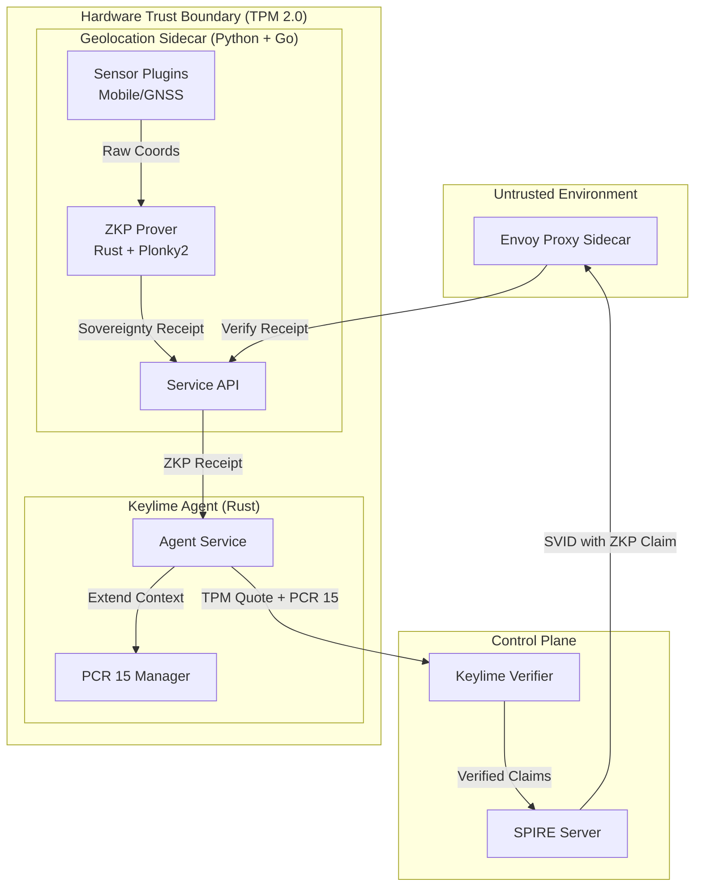

# Privacy-Preserving Geolocation Verification for Auditors

> **For Technical Auditors & Architects:** This document provides a deep-dive on **privacy-preserving geolocation verification** for regulatory compliance (e.g., Reg-K, GDPR). For the underlying hardware and identity architecture, see **[Unified Identity & Trust Framework](../hybrid-cloud-poc/README-arch-sovereign-unified-identity.md)**. For Layer 3 AI governance, see **[Privacy-Preserving AI Governance](./auditor-privacy-preserving-ai-governance.md)**.

---

## 1. The Problem: The Residency vs. Privacy Deadlock

Regulators require **proof of data residency** (e.g., **Regulation K**), but traditional geofencing creates a fundamental conflict:

| Requirement | Traditional Approach | Liability / Risk |
|-------------|---------------------|------------------|
| **Prove Data Residency** | Log precise GPS coordinates | Creates massive PII liability under GDPR |
| **Comply with GDPR** | Don't store location data | Cannot prove Reg-K compliance |
| **Prevent Location Spoofing** | Rely on IP-based geofencing | Trivially bypassed with VPNs |

**The Deadlock:** Enterprises are forced to choose between **non-compliance with residency laws** or **privacy violation under GDPR**.

---

## 2. Privacy-Preserving Techniques: A Technical Comparison

Multiple Privacy-Enhancing Technologies (PETs) exist for protecting location data. Below is an analysis of why **Zero-Knowledge Proofs (ZKPs)** are optimal for geolocation compliance.

| Technology | How It Works | Pros | Cons for Geolocation |
|------------|--------------|------|----------------------|
| **Trusted Execution Environments (TEEs)** | Process location inside hardware enclaves (Intel SGX, AMD SEV) | Low overhead, real-time processing | Requires external auditor to trust the enclave; no portable proof for regulators |
| **Homomorphic Encryption (FHE)** | Compute on encrypted coordinates without decryption | Strong mathematical guarantees | **1000x+ overhead** makes real-time geofencing impractical |
| **Secure Multi-Party Computation (MPC)** | Distribute computation across multiple parties | No single party sees full data | Network latency; operational complexity for mobile devices |
| **Differential Privacy** | Add noise to location data | Protects individual coordinates | **Cannot prove exact boundary compliance** (noise defeats precision) |
| **Zero-Knowledge Proofs (ZKPs)** | Prove statement about data without revealing data | Portable proof; auditor-verifiable; no data retention | Proof generation overhead (mitigated by batching) |

### Why ZKP is Optimal for Geolocation Compliance

1. **Portable Proof:** Unlike TEEs, ZKPs produce a proof that can be verified by any auditor without trusting specific hardware.
2. **Exact Compliance:** Unlike Differential Privacy, ZKPs prove the coordinate is **exactly** within the boundary—no approximations.
3. **No Retained Data:** The proof is generated device-side; raw coordinates never leave the device.
4. **Auditor Independence:** Regulators verify the mathematical proof, not the Enterprise's attestation claims.
5. **Batching for Performance:** While individual proof generation has overhead, session-level batching amortizes costs.

> [!NOTE]
> **AegisSovereignAI Hybrid Approach:** We combine **TEEs** (for secure real-time filtering) with **ZKPs** (for auditor-verifiable compliance proofs), achieving both performance and regulatory portability.

---

## 3. The AegisSovereignAI Solution: Hardware-Rooted Privacy-Preserving Geofencing

AegisSovereignAI resolves this deadlock using a **"Coordinate-in-Polygon" ZKP circuit** combined with hardware-rooted sensor fusion.

### The Architecture

```
┌─────────────────────────────────────────────────────────────────────────────┐
│                     PRIVACY-PRESERVING GEOLOCATION FLOW                      │
└─────────────────────────────────────────────────────────────────────────────┘

  Device (BYOD/Managed)              Aegis Verifier              Auditor
  ═══════════════════════            ══════════════              ════════

  ┌──────────────────────┐
  │  Hardware Sensors    │
  │  (TPM-signed GPS +   │
  │   CAMARA Mobile API) │
  └──────────┬───────────┘
             │
             ▼
  ┌──────────────────────┐
  │  ZKP Circuit Engine  │
  │  (Coordinate-in-     │
  │   Polygon Proof)     │
  └──────────┬───────────┘
             │
             │  Private: Precise GPS coordinates
             │  Public: Compliance boundary polygon
             │
             ▼
  ┌──────────────────────┐          ┌─────────────────────┐
  │  ZKP Proof Generated │────────▶│  Verify ZKP Proof   │
  │  (No raw GPS sent)   │          │  + Hardware Quote   │
  └──────────────────────┘          └──────────┬──────────┘
                                               │
                                               ▼
                                    ┌─────────────────────┐
                                    │  SVID Issued with   │
                                    │  Geolocation Claim: │
                                    │  • status: COMPLIANT│
                                    │  • region: US-EAST  │──────▶ Evidence
                                    │  • proof: base64... │        Bundle
                                    └─────────────────────┘

  🔑 KEY INSIGHT: The Enterprise never sees raw GPS coordinates.
     The auditor receives a cryptographic proof of compliance.
```

### The Geolocation Sidecar Architecture

The AegisSovereignAI architecture uses a **Geolocation Sidecar** alongside the Keylime Agent. The sidecar handles location collection and **stateless ZKP generation**, while the Keylime Agent handles all TPM operations. Both run in the **same trust boundary** on the attested host.



#### Sensor Modes

| Mode | Location Source | ZKP Generator | TPM Operations | Verification |
|------|-----------------|---------------|----------------|--------------|
| **(1) GNSS** | Local device | Sidecar (ZKP Prover) | Agent (PCR 15 extend) | Keylime & Envoy |
| **(2.1) Mobile** | MNO via CAMARA | Sidecar (ZKP Prover) | Agent (PCR 15 extend) | Keylime & Envoy |
| **(2.2) Workforce** | Corporate Lease | Sidecar (ZKP Prover) | Agent (PCR 15 extend) | Real-time SVID |

#### GNSS Trust Tiers

| Tier | GNSS Type | Hardware Signing | Trust Level |
|------|-----------|------------------|-------------|
| **Tier 1** | u-blox (secure element) | ✅ Native HW signature | Highest (end-to-end HW chain) |
| **Tier 2** | Consumer GNSS | ❌ None (raw NMEA) | Standard (TPM output sig only) |

> [!NOTE]
> For Tier 2 GNSS, the sidecar reads raw coordinates (no HW signature), generates the ZKP, and the Keylime Agent TPM-signs the output. The TPM output signature is the sole hardware attestation. Enterprise policy can enforce "Tier 1 only" for high-security workloads.

### Modern ZKP: From Groth16 to Plonky2

AegisSovereignAI 0.2.0 establishes a new standard for performance and transparency by migrating the ZKP engine to **Plonky2** (a recursive SNARK based on PLONK and FRI).

| Feature | Gen 3 (Groth16) | Gen 4 (Plonky2) | Auditor Benefit |
| :--- | :--- | :--- | :--- |
| **Trusted Setup** | ❌ Required (per circuit) | ✅ **Transparent (None)** | No risk of "backdoored" setup parameters. |
| **Verification** | Pairing-based | Hash-based (FRI) | Post-Quantum Resistance foundations. |
| **Performance** | ~200ms generation | **~50ms generation** | Low latency geofencing for mobile apps. |
| **Complexity** | Millions of gates | Efficient custom gates | Faster audits of circuit logic. |


### Sensor Hardware Attestation (Anti-Swap Protection)

The **full sensor hardware metadata** is included in the TPM attestation (PCR 15 extension). This prevents rogue admins or users from swapping sensors without detection.

| Sensor Type | Attested Fields | Unique Identifier |
|-------------|-----------------|-------------------|
| **Mobile** | `sensor_id`, `sensor_imei`, `sensor_imsi` | `sensor_imei` (IMEI) |
| **GNSS** | `sensor_id`, `sensor_serial_number` | `sensor_serial_number` |

**How it works:**
1. Sidecar collects sensor hardware metadata at location capture time
2. Keylime Agent hashes the full geolocation response (including all HW fields) with nonce
3. PCR 15 is extended with this hash
4. If an attacker swaps the sensor, the `sensor_imei` or `sensor_serial_number` changes
5. The PCR 15 value will differ from expected—Verifier detects the mismatch

```json
// Example: Full sensor metadata in PCR 15 hash
{
  "sensor_type": "mobile",
  "mobile": {
    "sensor_id": "12d1:1433",           // Manufacturer (USB ID)
    "sensor_imei": "860123456789012",   // UNIQUE to this modem
    "sensor_imsi": "214070123456789",   // SIM subscriber ID
    "sensor_msisdn": "+34696810912"     // Phone number
  },
  "tpm_attested": true,
  "tpm_pcr_index": 15
}
```

> [!IMPORTANT]
> **Code Reference:** See [`geolocation_handler.rs`](../hybrid-cloud-poc/rust-keylime/keylime-agent/src/geolocation_handler.rs#L377-L383) for the PCR 15 extension implementation that includes full sensor metadata.

### The ZKP Circuit

#### Choosing a ZKP Proving System

AegisSovereignAI requires a ZKP system with **no trusted setup** to avoid centralized trust assumptions. The table below compares leading options:

| System | Trusted Setup | Proof Size | Prove Time | Verify Time | Library |
|--------|---------------|------------|------------|-------------|---------|
| **Groth16 (KZG)** | ❌ Per-circuit ceremony | ~192 B | ~200ms | ~1ms | gnark (Go) |
| **Plonky2** | ✅ None | ~1.4 KB | ~70ms | ~3ms | 0xPolygonZero (Rust) |
| **STARKs** | ✅ None | ~50-200 KB | ~500ms | ~10ms | StarkWare/stone |
| **Halo2 (IPA)** | ✅ None | ~1-5 KB | ~400ms | ~5ms | zcash/halo2 (Rust) |
| **Plonky3** | ✅ None | ~1.4 KB | ~30-50ms | ~2ms | 0xPolygonZero (Rust) |

> [!IMPORTANT]
> **Recommendation: Plonky2 (Implemented)**
> - **No trusted setup:** Eliminates ceremony trust and per-circuit key generation
> - **Fastest proving:** ~70ms (4x faster than Halo2) — critical for mobile/edge sensors
> - **Small proofs:** ~1.4 KB
> - **Rust ecosystem:** Aligns with Keylime Agent (Rust) for native integration
> - **Battle-tested:** Powers Polygon zkEVM in production
>
> *Plonky3 is even faster but still maturing (as of 2024). Halo2 remains a solid fallback if Plonky2 integration proves complex.*

#### What Is Public vs. Private

| Category | Data | Visibility |
|----------|------|------------|
| **Private Inputs** | Latitude, Longitude, SensorID | ❌ Never revealed |
| **Public Inputs** | CenterLat, CenterLong, Radius, IDHash | ✅ Known to verifier |
| **Proof Artifact** | Binary proof blob (~1400 B for Plonky2) | ✅ Transmitted |
| **Verifying Key** | Derived from circuit (one per circuit, not per policy) | ✅ Pre-shared |

The verifier learns only: **"Yes, the device is within the geofence"** — never the exact coordinates.

#### Circuit Definition (Plonky2)

The implementation uses a **Plonky2 ZKP circuit** (FRI-based), providing transparent setup and extremely fast proof generation critical for real-time mobile attestation.

```rust
// Conceptual Rust Circuit (Plonky2)
#[derive(Clone)]
struct GeofenceCircuit {
    // Private Inputs (witness)
    latitude: Value<Fp>,
    longitude: Value<Fp>,
    sensor_id: Value<Fp>,

    // Public Inputs (instance)
    center_lat: Value<Fp>,
    center_long: Value<Fp>,
    radius: Value<Fp>,
    id_hash: Value<Fp>,
}

impl Circuit<Fp> for GeofenceCircuit {
    fn synthesize(&self, mut layouter: impl Layouter<Fp>) -> Result<(), Error> {
        // 1. Verify Distance (Squared distance to avoid square roots)
        // (lat - center_lat)² + (long - center_long)² ≤ radius²
        let d_lat = self.latitude - self.center_lat;
        let d_long = self.longitude - self.center_long;
        let dist_sq = d_lat * d_lat + d_long * d_long;
        let radius_sq = self.radius * self.radius;
        layouter.constrain_instance(dist_sq.cell(), column, row)?;
        // Assert: dist_sq <= radius_sq

        // 2. Verify Identity Binding (Commitment to hardware ID)
        // Assert: sensor_id == id_hash
        layouter.constrain_instance(self.sensor_id.cell(), column, row)?;
        Ok(())
    }
}
```

> [!IMPORTANT]
> **Performance (Plonky2):** Proof generation takes **~70ms**, enabling the sidecar to provide "fresh" geofence proofs without stalling mobile sensor hardware. Verification takes **~3ms**, allowing the Envoy sidecar to validate every SVID in real-time. Proof size is **~1.4 KB**.

### TPM-Attested ZKP Output: Mode-Specific Flows

The **Geolocation Sidecar** generates the ZKP proof, then passes it to the **Keylime Agent** for TPM attestation via PCR 15 extension. The flow varies by sensor mode:

> [!NOTE]
> **Platform Support:** Keylime is designed for **Linux servers** with TPM 2.0. For **client devices** (iOS, Android, Windows), alternative attestation components are used:
> - **iOS:** Apple App Attest + Secure Enclave
> - **Android:** Android Key Attestation + StrongBox
> - **Windows:** SGRM (System Guard Runtime Monitor)
> 
> See **[Unified Identity Framework](../hybrid-cloud-poc/README-arch-sovereign-unified-identity.md)** for cross-platform attestation details.

#### Mode 1: GNSS (Local Sensor)

```
┌─────────────────────────────────────────────────────────────────────────┐
│          MODE 1: GNSS WITH OPTIONAL HARDWARE SIGNING                    │
└─────────────────────────────────────────────────────────────────────────┘

  Geolocation Sidecar              Keylime Agent              Auditor
  ═══════════════════              ═════════════              ════════

  ┌──────────────────────┐
  │  1. GNSS Sensor      │
  │     Reads Coords     │
  │     (optionally HW-  │
  │      signed)         │
  └──────────┬───────────┘
             │
             ▼
  ┌──────────────────────┐
  │  2. ZKP Circuit      │
  │     Generates Proof  │
  │     (+ sensor_serial)│
  └──────────┬───────────┘
             │
             ▼                       ┌─────────────────────┐
  ┌──────────────────────┐          │  3. PCR 15 Extend   │
  │  ZKP Proof +         │─────────►│     hash(geo +      │
  │  Sensor Metadata     │          │      sensor_hw +    │
  └──────────────────────┘          │      nonce)         │
                                    └──────────┬──────────┘
                                               │
                                               ▼
                                    ┌─────────────────────┐
                                    │  4. Generate Quote  │────────►
                                    │     (includes PCR15)│
                                    └─────────────────────┘
```

#### Mode 2.1: Mobile Network (Direct Location Retrieval)

```
┌─────────────────────────────────────────────────────────────────────────┐
│       MODE 2.1: MOBILE NETWORK VIA CAMARA (DIRECT RETRIEVAL)            │
└─────────────────────────────────────────────────────────────────────────┘

  Geolocation Sidecar              Keylime Agent              Auditor
  ═══════════════════              ═════════════              ════════

  ┌──────────────────────┐
  │  1. Call CAMARA      │
  │     location-        │
  │     retrieve API     │
  │     (MNO returns     │
  │      lat/lon)        │
  └──────────┬───────────┘
             │
             ▼
  ┌──────────────────────┐
  │  2. ZKP Circuit      │
  │     Generates Proof  │
  │     (+ sensor_imei)  │
  └──────────┬───────────┘
             │
             ▼                       ┌─────────────────────┐
  ┌──────────────────────┐          │  3. PCR 15 Extend   │
  │  ZKP Proof +         │─────────►│     hash(geo +      │
  │  Sensor Metadata     │          │      sensor_hw +    │
  └──────────────────────┘          │      nonce)         │
                                    └──────────┬──────────┘
                                               │
                                               ▼
                                    ┌─────────────────────┐
                                    │  4. Generate Quote  │────────►
                                    │     (includes PCR15)│
                                    └─────────────────────┘
```

#### Mode 2.2: Mobile Network (Boundary Verification - Future Extension)

> [!WARNING]
> **Future Extension:** Mode 2.2 requires CAMARA API extension to return ZKP proofs. Current CAMARA `location-verify` returns only boolean results. This mode documents the proposed architecture pending CAMARA standardization.

```
┌─────────────────────────────────────────────────────────────────────────┐
│       MODE 2.2: MOBILE NETWORK VIA CAMARA (BOUNDARY VERIFY)             │
└─────────────────────────────────────────────────────────────────────────┘

  Geolocation Sidecar              Keylime Agent              Auditor
  ═══════════════════              ═════════════              ════════

  ┌──────────────────────┐
  │  1. Call CAMARA      │
  │     location-verify  │
  │     (MNO generates   │
  │      ZKP proof)      │
  └──────────┬───────────┘
             │
             ▼
  ┌──────────────────────┐
  │  2. Receive MNO ZKP  │
  │     + MNO Signature  │
  │     (no local ZKP    │
  │      generation)     │
  └──────────┬───────────┘
             │
             ▼                       ┌─────────────────────┐
  ┌──────────────────────┐          │  3. PCR 15 Extend   │
  │  MNO ZKP +           │─────────►│     hash(mno_zkp +  │
  │  Sensor Metadata     │          │      sensor_hw +    │
  └──────────────────────┘          │      nonce)         │
                                    └──────────┬──────────┘
                                               │
                                               ▼
                                    ┌─────────────────────┐
                                    │  4. Generate Quote  │────────►
                                    │     (includes PCR15)│
                                    └─────────────────────┘
```

**Why Sidecar + Agent Separation Matters:**
1. **Separation of Concerns:** Sidecar handles sensor I/O and ZKP computation; Agent handles TPM operations
2. **Same Trust Boundary:** Both components run on the same attested host, so no additional network hops
3. **Open Source Verifiability:** Like Keylime Agent, the sidecar code is open source for audit
4. **Sensor Hardware Binding:** Full sensor metadata (IMEI/serial) is included in PCR 15 hash, preventing sensor swaps
5. **No Replay:** An attacker cannot replay a ZKP from elsewhere—the PCR 15 value would mismatch

> [!NOTE]
> **Performance Impact:** Geolocation proofs are refreshed every 1-5 minutes (not per-request). At this frequency, the ~100ms TPM PCR extension overhead is negligible.

---


## 5. Multi-Sensor Fusion: Defeating Spoofing Attacks

AegisSovereignAI uses **hardware-rooted multi-sensor fusion** via the **Geolocation Sidecar** to prevent location spoofing. The sidecar collects data from multiple sensor sources and generates ZKP proofs that the Keylime Agent TPM-attests.

### Sensor Hierarchy

| Sensor Type | Trust Level | Verification Method |
|-------------|-------------|---------------------|
| **CAMARA Mobile API** | Highest | MNO-verified SIM location via OIDC |
| **TPM-Signed GNSS** | High | Hardware-rooted GPS signatures |
| **App-Level GPS** | Low | Cross-validated against higher-trust sensors |

> [!IMPORTANT]
> **All Location Sources Have Privacy Implications:** Not just GPS—mobile network location (CAMARA/MNO) can also be precise (50-200m via cell triangulation), creating GDPR liability. The ZKP approach applies to **all sensor types**: the Enterprise never stores raw coordinates regardless of source.

### Attack Resistance

| Attack Vector | Traditional Vulnerability | Aegis Defense |
|---------------|---------------------------|---------------|
| **VPN Spoofing** | IP-based checks fail | Hardware sensors ignore network layer |
| **GPS Spoofing App** | App-level coordinates faked | TPM signature verification fails |
| **Frida/API Hooking** | Runtime API interception | CAMARA API bypasses app layer entirely |
| **Rooted/Jailbroken Device** | Full sensor control | Secure Enclave attestation detects compromise |

> **Deep-Dive:** For complete attack analysis, see **[Threat Model: Unmanaged Device Security](../hybrid-cloud-poc/THREAT-MODEL-unmanaged-device.md)**.

---

## 6. The SVID Geolocation Claims

When geolocation verification succeeds, the claims are embedded in the **SPIFFE Verifiable Identity Document (SVID)**:

```json
{
  "svid": "spiffe://aegis.local/workload/private-wealth-advisory",
  "claims": {
    "grc.geolocation.status": "compliant",
    "grc.geolocation.region_id": "US-EAST-1",
    "grc.geolocation.proof": "base64-zkp-proof...",
    "grc.geolocation.timestamp": "2026-01-20T14:00:00Z",
    "grc.geolocation.sensor_type": "CAMARA_MNO",
    "grc.tpm-attestation.tier": "tier-2-byod"
  },
  "attestation_quote": "base64-tpm-quote..."
}
```

### Claim Semantics

| Claim | Type | Example | Description |
|-------|------|---------|-------------|
| `grc.geolocation.status` | enum | `compliant` | ZKP-verified geofence result |
| `grc.geolocation.region_id` | string | `US-EAST-1` | Broad compliance region (Reg-K) |
| `grc.geolocation.proof` | base64 | `eyJ...` | The actual ZKP proof for auditor verification |
| `grc.geolocation.sensor_type` | enum | `CAMARA_MNO` | Which sensor provided the location |

---

## 7. Enterprise Use Case: Private Wealth Gen-AI Advisory

### Scenario (Use Case 1 - Enterprise Customer)

A high-net-worth client uses the **Private Wealth Gen-AI Advisory** from their personal mobile device. The bank must prove to an EU regulator that the AI inference stayed within the EEA (**Reg-K** compliance), but cannot store raw GPS data (**GDPR** violation).

### The Privacy-Preserving Flow

1. **Client opens app** on personal iPhone/Android
2. **CAMARA API** verifies device location via MNO (carrier-level, not app-level)
3. **ZKP circuit** generates proof: "Device is within EEA boundary"
4. **SVID issued** with `grc.geolocation.status: compliant` and `grc.geolocation.region_id: EEA`
5. **AI inference executes** with verified geolocation claim
6. **Evidence Bundle** includes ZKP proof for auditor

**Result:** The bank proves Reg-K compliance without ever touching raw GPS coordinates.

---

## 8. The Evidence Bundle for Auditors

When an auditor requests geolocation compliance evidence:

```json
{
  "bundle_type": "GEOLOCATION_COMPLIANCE",
  "audit_window": {
    "start": "2026-01-20T00:00:00Z",
    "end": "2026-01-20T23:59:59Z"
  },
  "compliance_boundary": {
    "name": "EEA_REGULATION_K",
    "polygon_hash": "sha256:abc123..."
  },
  "sessions": [
    {
      "session_id": "sess-001",
      "svid": "spiffe://aegis.local/workload/private-wealth-advisory",
      "geolocation_claim": {
        "status": "compliant",
        "region_id": "EEA",
        "sensor_type": "CAMARA_MNO",
        "zkp_proof": "base64-plonky2-proof..."
      },
      "timestamp": "2026-01-20T14:00:00Z"
    }
  ],
  "aggregate_stats": {
    "total_sessions": 15847,
    "compliant_sessions": 15847,
    "non_compliant_sessions": 0
  },
  "signatures": {
    "aegis_geolocation_jws": "eyJhbGciOiJSUzI1NiIs..."
  }
}
```

### Auditor Verification Workflow

1. **Verify Boundary Definition:** Confirm the `polygon_hash` matches the official Reg-K boundary.
2. **Verify ZKP Proofs:** For each session (or sample), verify the ZKP proof against the boundary.
3. **Verify Hardware Attestation:** Confirm the session was on attested hardware via SVID.
4. **Aggregate Compliance:** Confirm all sessions in the audit window are compliant.

### Example: Policy Proof Generation & Verification

> [!NOTE]
> **Public Boundary Policy:** Unlike proprietary prompt logic, geolocation compliance boundaries (e.g., "EEA", "US-EAST") are defined by regulation—not trade secrets. Sharing the exact boundary polygon with auditors is a **reasonable default**.

#### Step 1: Enterprise Generates Policy Proof

The Enterprise defines the compliance boundary and generates a verifiable policy commitment:

```json
// POLICY DEFINITION (Public - shared with Auditor)
{
  "policy_name": "EEA_REGULATION_K_v2",
  "policy_version": "2026.1",
  "boundary_polygon": [
    {"lat": 71.185, "lon": -9.55},   // Norway (northwest)
    {"lat": 71.185, "lon": 31.59},   // Finland (northeast)
    {"lat": 34.80, "lon": 31.59},    // Cyprus (southeast)
    {"lat": 36.00, "lon": -9.55}     // Portugal (southwest)
  ],
  "policy_hash": "sha256:7f83b1657ff1fc53b92dc18148a1d65dfc2d4b1fa3d677284addd200126d9069"
}
```

The Keylime Agent Plugin generates ZKP proofs using this policy:

```
Enterprise Server (Keylime Agent Plugin)
═════════════════════════════════════════

1. Load Policy: EEA_REGULATION_K_v2
2. Receive TPM-signed GPS: (48.8566, 2.3522)  ← Paris
3. ZKP Circuit: point_in_polygon(48.8566, 2.3522, EEA_BOUNDARY) → TRUE
4. Generate Proof: π = Prove(coordinates, boundary, tpm_sig)
5. TPM Sign Output: output_sig = TPM_Sign(SHA256(π))
6. Emit SVID Claim: grc.geolocation.status = "compliant"
```

#### Step 2: Auditor Verifies Proof

The Auditor receives the Evidence Bundle and verifies independently:

```
Auditor Verification (Independent)
══════════════════════════════════

1. Retrieve Policy: Download EEA_REGULATION_K_v2 from regulatory registry
2. Verify Policy Hash: SHA256(boundary_polygon) == "sha256:7f83b..." ✓
3. Verify ZKP Proof: 
   - Load proof π from Evidence Bundle
   - Load public inputs: boundary_polygon, tpm_public_key, timestamp
   - Run Plonky2 Verifier: Verify(π, public_inputs) → TRUE ✓
4. Verify TPM Output Signature:
   - Verify output_sig against Keylime-registered TPM public key ✓
5. Conclusion: "Session was on verified hardware within EEA boundary"
```

**Key Insight:** The Auditor never sees the precise GPS coordinates (48.8566, 2.3522). They only verify that:
- A valid TPM-signed coordinate existed (input integrity)
- That coordinate was inside the EEA polygon (compliance)
- The proof was generated on a specific Keylime-attested server (output integrity)

---

## 9. Regulatory Mapping

| Regulatory Need | AegisSovereignAI Implementation |
|-----------------|--------------------------------|
| **Reg-K (Data Residency)** | ZKP proves location within boundary without storing coordinates |
| **GDPR Art. 5 (Data Minimization)** | No raw GPS data ever leaves the device |
| **GDPR Art. 25 (Privacy by Design)** | Hardware-rooted ZKP is privacy-first architecture |
| **EU AI Act (Transparency)** | Auditor receives verifiable proof, not opaque assertions |

---

## 10. Integration with Layer 3 AI Governance

Geolocation verification is a **Layer 2 prerequisite** for Layer 3 AI Governance. The modular architecture:

```
┌─────────────────────────────────────────────────────────────┐
│  MODULAR EVIDENCE BUNDLE VERIFICATION                       │
└─────────────────────────────────────────────────────────────┘

  Stage 1: Environmental Trust (This Document)
  ═════════════════════════════════════════════
  ✓ Is this a genuine, untampered device?
  ✓ Is the device within the compliance boundary?
  ✓ Is the SVID bound to attested hardware?
                    │
                    ▼
  Stage 2: Content Trust (AI Governance)
  ═══════════════════════════════════════
  ✓ Did the system prompt contain required guardrails?
  ✓ Were user prompts scanned for injection attacks?
  ✓ Were AI outputs filtered for PII leakage?
  
  See: [Privacy-Preserving AI Governance](./auditor-privacy-preserving-ai-governance.md)
```

---

[Root README](../README.md) | [Auditor Guide](./auditor.md) | [Unified Identity Framework](../hybrid-cloud-poc/README-arch-sovereign-unified-identity.md) | [AI Governance (Layer 3)](./auditor-privacy-preserving-ai-governance.md)
